# Decision Logic Diagram

This diagram shows the complete decision-making pipeline of the Decision Companion System.

> **To view this diagram**: Paste the Mermaid code below into [mermaid.live](https://mermaid.live) or view it directly on GitHub (which renders Mermaid natively).

```mermaid
flowchart TD
    A["🖥️ User runs main.py"] --> B{"Mode?"}

    B -->|"--interactive"| C1["User defines category\n(cars, phones, etc.)"]
    B -->|"Default"| C2["Load laptops.json\n(6 laptops)"]

    C1 --> D1["User defines criteria\nName, Direction h/l,\nUnit, Weight"]
    D1 --> E1["User enters options\nName + value per criterion"]
    E1 --> F["Validate weights\nΣ weights == 1.0?"]

    C2 --> W{"--weights\nprovided?"}
    W -->|"YES"| W1["Use custom weights\nfrom CLI args"]
    W -->|"NO"| W2["Use defaults\nPrice 40% | Perf 30%\nBatt 20% | Wt 10%"]
    W1 --> F
    W2 --> F

    F -->|"❌ No"| ERR["❌ ValueError:\nWeights must sum to 1.0"]
    F -->|"✅ Yes"| G

    subgraph NORM ["Step 1: Normalisation — normalizer.py"]
        G["For each criterion:\nCollect raw values\nFind min, max, range"] --> H{"range == 0?"}
        H -->|"YES"| H1["All identical →\nnorm = 10.0"]
        H -->|"NO"| H2{"Direction?"}
        H2 -->|"higher_is_better"| H3["norm = (val − min)\n÷ range × 10"]
        H2 -->|"lower_is_better"| H4["norm = (max − val)\n÷ range × 10"]
        H1 --> I["Normalised scores\n0–10 per option per criterion"]
        H3 --> I
        H4 --> I
    end

    subgraph SCORE ["Step 2: Weighted Scoring — decision_engine.py"]
        I --> J["For each option:\nweighted = norm × weight\ntotal = Σ weighted scores"]
    end

    subgraph RANK ["Step 3: Ranking"]
        J --> K["Sort by total_score DESC\nAssign rank 1 = best"]
    end

    subgraph EXPLAIN ["Step 4: Explanation — explanation_engine.py"]
        K --> L["Per-criterion breakdown:\nraw → norm → label → weighted"]
        L --> L1["Strengths: norm ≥ 7.0\nWeaknesses: norm ≤ 3.0"]
        L1 --> L2["Verdict: score tier\n≥7.5 top-tier | ≥6.0 strong\n≥4.5 mid-range | else niche"]
        L2 --> L3["Gap to winner:\nlargest weighted difference"]
    end

    L3 --> S{"--sensitivity\nflag?"}
    S -->|"NO"| REC
    S -->|"YES"| SA

    subgraph SENS ["Step 5: Sensitivity Analysis — sensitivity_analysis.py"]
        SA["For each criterion ±10%:\nRedistribute remaining\nweights proportionally"] --> SA1["Re-run full pipeline\nnormalize → score → rank"]
        SA1 --> SA2{"Winner\nchanged?"}
        SA2 -->|"Record"| SA3["Stability Score\n= unchanged / total scenarios"]
        SA3 --> SA4["Tipping-Point Search\nScan 1% increments\nFind minimum flip delta"]
        SA4 --> SA5["Rank-Shift Matrix\nEvery option's rank\nacross all scenarios"]
        SA5 --> SA6{"Stability\nlevel?"}
        SA6 -->|"≥ 85%"| ST1["🟢 Highly Stable"]
        SA6 -->|"≥ 55%"| ST2["🟡 Moderately Stable"]
        SA6 -->|"< 55%"| ST3["🔴 Highly Sensitive"]
    end

    ST1 --> REC
    ST2 --> REC
    ST3 --> REC

    REC["🏆 RECOMMENDATION\nBest option + score\n+ verdict + confidence"]

    style NORM fill:#1a1a2e,stroke:#00d4ff,color:#fff
    style SCORE fill:#1a1a2e,stroke:#00d4ff,color:#fff
    style RANK fill:#1a1a2e,stroke:#00d4ff,color:#fff
    style EXPLAIN fill:#1a1a2e,stroke:#00ff88,color:#fff
    style SENS fill:#1a1a2e,stroke:#ff6600,color:#fff
    style ERR fill:#ff3333,stroke:#ff0000,color:#fff
    style REC fill:#00aa55,stroke:#00ff88,color:#fff
```

---

## Key Decision Points

| # | Decision Point | Module | Outcomes |
|---|---|---|---|
| 1 | Default or Interactive? | `main.py` | Two branches with different input methods |
| 2 | Custom `--weights` provided? | `main.py` | Use custom or default criteria |
| 3 | Weights sum to 1.0? | `decision_engine.py` | Continue or raise error |
| 4 | Range == 0 for a criterion? | `normalizer.py` | All get 10.0 or apply formula |
| 5 | Higher or lower is better? | `normalizer.py` | Two different normalisation formulas |
| 6 | `--sensitivity` flag? | `main.py` | Run sensitivity or skip to recommendation |
| 7 | New weight valid (0 < w < 1)? | `sensitivity_analysis.py` | Run scenario or skip |
| 8 | Winner changed? | `sensitivity_analysis.py` | Record flip or continue scanning |

## Module ↔ Step Mapping

| Module | Pipeline Steps |
|---|---|
| `main.py` | Input routing, CLI flags, output display |
| `models.py` | Data structures used across all steps |
| `normalizer.py` | Step 1 — Min-max normalisation |
| `decision_engine.py` | Step 2 — Weighted scoring + Step 3 — Ranking |
| `explanation_engine.py` | Step 4 — Algorithmic explanations |
| `sensitivity_analysis.py` | Step 5 — Robustness testing |
| `streamlit_app.py` | Web UI rendering layer (calls same pipeline) |
